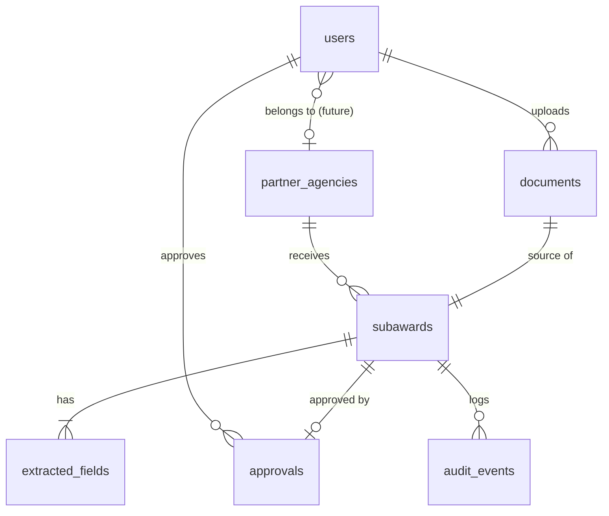

# Architecture

## Guiding principle

**AI extracts. Code validates. Humans approve.** Each responsibility lives in a
separate module so it can be tested and audited on its own:

| Responsibility | Module | Can it decide compliance? |
|---|---|---|
| Read the agreement | `server/src/pdf/pdf.ts` | No |
| Propose values | `server/src/ai/*Extractor.ts` | **No** — prompt forbids it; output is only data |
| Check the proposal is grounded | `server/src/ai/responseParser.ts` | No — only lowers confidence |
| Apply compliance rules | `server/src/domain/validation.ts` | Yes — deterministic, pure TypeScript |
| Approve | Human, via `SubawardService.approve` | Yes — but only when validation has no ERROR |

## Request flow: upload

```mermaid
sequenceDiagram
  participant B as Browser
  participant A as Express API
  participant S as Storage (disk/S3)
  participant C as Claude (or demo simulator)
  participant D as PostgreSQL
  B->>A: POST /api/subawards/upload (multipart PDF)
  A->>A: auth + role check, rate limit, size limit
  A->>A: magic bytes %PDF-, SHA-256, duplicate check
  A->>A: pdf-parse → text (reject if no text)
  A->>S: put(buffer) → agreements/<uuid>.pdf
  A->>C: extract(text)  [tool-forced JSON]
  C-->>A: {field: {value, confidence, sourceExcerpt}}
  A->>A: schema check + excerpt grounding
  A->>A: validateSubaward() → PASS/WARNING/ERROR
  A->>D: BEGIN; documents, subawards, extracted_fields, audit_events; COMMIT
  A-->>B: 201 {subaward detail}
```

## Data model



* `extracted_fields.ai_*` columns keep the original model output forever
  (DB trigger forbids changes); `current_value` holds the reviewer's value.
* `subawards` keeps typed, normalised copies (`uei`, `amount numeric`, `award_date`,
  `due_date`) for querying and export.
* `approvals.snapshot` freezes exactly what was approved, including AI originals,
  confidences, excerpts, and every validation check.
* `audit_events` is append-only (DB trigger), timestamped with `clock_timestamp()`
  so events inside one transaction keep their order.

## Status model

```
awaiting_review ──approve (no ERRORs, attestation)──► approved ──mark reported──► reported
      ▲  │ save draft / edits (audited)                    │ export CSV (audited, repeatable)
      └──┘
```

"Due soon" and "overdue" are *derived* from the due date and status at read time,
so they are always current without a scheduled job.

## Validation is recomputed, not trusted

Validation results are recalculated from the stored values every time a record is
read (it is cheap and deterministic). Stored `validation_results` are the snapshot
taken at each audited "validation performed" event. This means rules that depend on
today's date (overdue, due soon) never go stale.

## Database engines

`server/src/db/index.ts` exposes one tiny `Db` interface implemented by:

* **PostgresDb** (`pg` pool) — local PostgreSQL, Docker, or Amazon RDS.
* **PgliteDb** — PostgreSQL compiled to WebAssembly, embedded in the Node process.
  Used for zero-install local development and for fast isolated API tests.

Both run the same SQL migration files, so behaviour (including triggers and
constraints) matches production.

## Frontend

* `session.tsx` — loads health/mode, current user and permissions; demo user switcher.
* `pages/ReviewPage.tsx` — two-column review: source (extracted text with
  highlighted excerpts, or the original PDF) and editable fields with confidence,
  excerpt, and per-field checks. Edits are validated live through
  `POST /validate-preview` (server rules, nothing saved), with unsaved-change
  guards on navigation and page unload.
* All requests go through `api/client.ts`, which converts failures into
  user-safe messages; raw server errors are never rendered.
